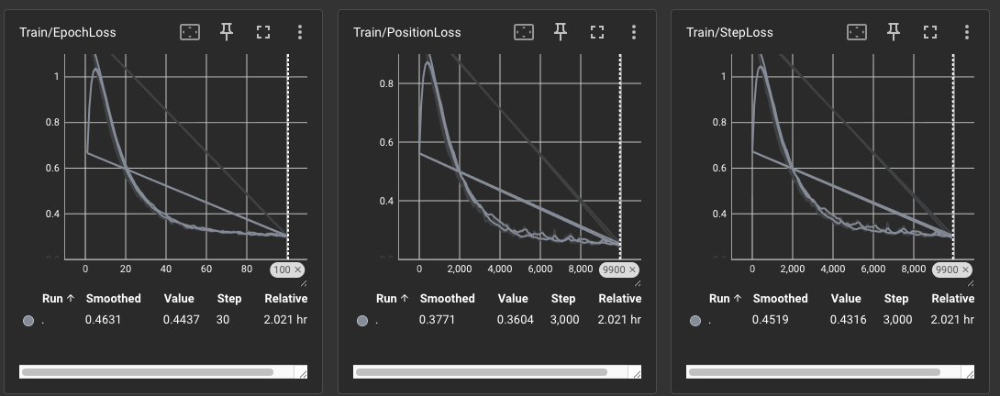
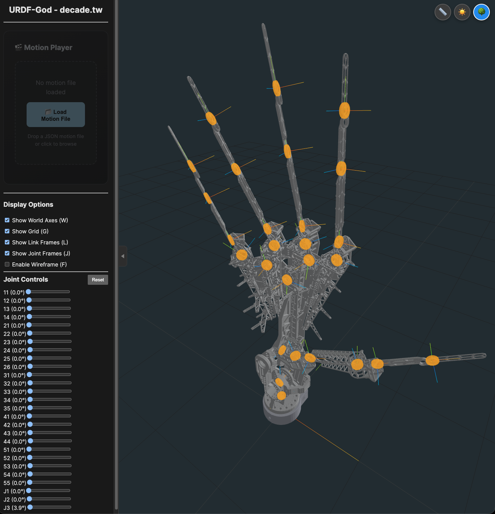

# ML_ROS_God
train a Trajectory Motion Diffusion ai/ML model.



## Goal

訓練ML模型可以結合中文英文的文字輸入情境描述，
輸出json格式的資訊(Trajectory motion json)。

## 系統架構

```
┌─────────────────────────────────────────────────────────────┐
│                    TEXT ENCODER (BERT)                      │
│  輸入: "微微握拳" / "Slightly fist"                           │
│  輸出: [512] condition vector                                │
└──────────────────────────┬──────────────────────────────────┘
                           │
              ┌────────────▼────────────┐
              │   SGM Diffusion Model    │
              │  (Score-based Generation)│
              └────────────┬────────────┘
                           │
                    ┌──────▼──────┐
                    │ Motion JSON │
                    │ [T, 54]     │
                    └─────────────┘
```
## resource/reference quick link
- URDF/motion-json validator https://urdf.decade.tw
- [URDF/motion-json validator demo video](https://youtube.com/shorts/Bc-gohPOcZE?si=orJNU6qQ1TBOZbJ4)

## issue
- 空間耦合（27個關節之間的協同運動學關係）與時間連續性（前後幀的流暢度，避免長序列飄移）
- 潛在空間可以對動作進行「風格化」或「情緒化」的微調（例如：悲傷的手勢、激進的手勢）。
- 不固定長度訓練集合
  - use difussion need fixed lentgh(frame)?

## Model algorithm design
- BERT/Chinese CLIP 512token x 768Embedding 
  * https://huggingface.co/google-bert/bert-base-chinese
- LSTM (maybe delta-degree not raw-deg)
- Two-Tower Network
- Time-series base motion(Trajectory)
- MDM / Motion Diffusion / SGM

```bash
  --text_dim 512 \
  --motion_dim 54 \
  --hidden_dim 256 \
  --batch_size 32 \
  --learning_rate 1e-4
```
## Dataset name define

- 左手掌與右手掌 JOINTS name mapping關節定義:
  - 食指 (Index): 11, 12, 13, 14 (4 joints)
  - 中指 (Middle finger): 21, 22, 23, 24, 25, 26 (6 joints)
  - 無名指 (Ring finger): 31, 32, 33, 34, 35 (5 joints)
  - 小姆指 (Pinky): 41, 42, 43, 44 (4 joints)
  - 大拇指 (Thumb): 51, 52, 53, 54, 55 (5 joints)
  - 手腕 (Wrist): J1 (Yaw), J2 (Pitch), J3 (Roll) (3 joints)

## Motion json format (left/right hand frame by frame @30FPS)
- [motion validator - http://urdf.decade.tw](http://urdf.decade.tw)
- [train dataset ](./dataset)
- motionExample-1(/dataset/motionFolder/opera_day5/OPERA_8_48600_54000_v4.txt)
- motionExample-3


### format (json array frame by frame)
```json
[
{"right":{"JOINTS":{"11":0,"12":0,"13":0,"14":0,"21":0,"22":0,"23":0,"24":0,"25":0,"26":0,"31":0,"32":0,"33":0,"34":0,"35":0,"41":0,"42":0,"43":0,"44":0,"51":0,"52":0,"53":0,"54":0,"55":0,"J1":0,"J2":0,"J3":0}},"left":{"11":0,"12":0,"13":0,"14":0,"21":0,"22":0,"23":0,"24":0,"25":0,"26":0,"31":0,"32":0,"33":0,"34":0,"35":0,"41":0,"42":0,"43":0,"44":0,"51":0,"52":0,"53":0,"54":0,"55":0,"J1":0,"J2":0,"J3":0},"FRAME_NOW":1,"TS":1781157772.929879}
,
{"right":{"JOINTS":{"11":0,"12":0,"13":0,"14":0,"21":0,"22":0,"23":0,"24":0,"25":0,"26":0,"31":0,"32":0,"33":0,"34":0,"35":0,"41":0,"42":0,"43":0,"44":0,"51":0,"52":0,"53":0,"54":0,"55":0,"J1":0,"J2":0,"J3":0}},"left":{"11":0,"12":0,"13":0,"14":0,"21":0,"22":0,"23":0,"24":0,"25":0,"26":0,"31":0,"32":0,"33":0,"34":0,"35":0,"41":0,"42":0,"43":0,"44":0,"51":0,"52":0,"53":0,"54":0,"55":0,"J1":0,"J2":0,"J3":0},"FRAME_NOW":2,"TS":1781157772.929879}
]
```
## 模型架構細節

### Text Encoder (文字塔)
- **Tokenizer**: bert-base-chinese character-level
- **Encoder**: BERT base (12 layers, d_model=768)
- **Pooling**: Mean Pooling
- **Projection**: Linear(768→512) → LayerNorm → GELU → Linear(512→512) → L2 Normalize

### Motion Diffusion Decoder (SGM Style)
- **Input**: condition_vector [512] + target_length
- **Length Embedding**: Sinusoidal embedding for frames
- **Decoder**: 4 × Transformer Decoder with Self-Attention + Cross-Attention
- **Output**: Linear(256→54) → Tanh()

### Loss Functions
- Position MSE Loss (预测 vs 真实 RPY angles)
- Velocity Smoothness Loss (帧间速度变化惩罚)

## train step

#### 1. 文字編碼流程 (Text Encoding)
- `batch['text_label']` 是一個包含所有批次文字標籤的 list，例如：`["微微握拳", "慢慢舉起右手", ...]`
#### 2. Diffusion 前向過程 (Forward Process - Noise Addition)

#### 3. 模型預測與解碼 (Model Prediction)

#### 4. 損失計算與反向傳播 (Loss Computation & Backpropagation)

#### 6. 後端監控與工程落地 (Monitoring & Production)
* TensorBoard 

* model output pt/onnx

```bash
python train.py \
--dataset_dir /path/to/dataset \
--output_dir output \
--num_epochs 100

    # 自定義配置
    python train.py \
        --text_dim 512 \
        --motion_dim 54 \
        --hidden_dim 256 \
        --batch_size 32 \
        --learning_rate 1e-4
```
TensorBoard監控:
```bash
uv run tensorboard --logdir=output/tensorboard_logs
```
## Quick Links

* Auto prompt by LLM and LLM-Vision (Trigger more details out inside model)
    * SD-WEB-UI: https://github.com/xlinx/sd-webui-decadetw-auto-prompt-llm
    * ComfyUI:   https://github.com/xlinx/ComfyUI-decadetw-auto-prompt-llm
* Auto msg to ur mobile  (LINE | Telegram | Discord)
    * SD-WEB-UI :https://github.com/xlinx/sd-webui-decadetw-auto-messaging-realtime
    * ComfyUI:  https://github.com/xlinx/ComfyUI-decadetw-auto-messaging-realtime
* I'm SD-VJ. (share SD-generating-process in realtime by gpu)
    * SD-WEB-UI: https://github.com/xlinx/sd-webui-decadetw-spout-syphon-im-vj
    * ComfyUI:   https://github.com/xlinx/ComfyUI-decadetw-spout-syphon-im-vj
* CivitAI Info|discuss:
    * https://civitai.com/articles/6988/extornode-using-llm-trigger-more-detail-that-u-never-thought
    * https://civitai.com/articles/6989/extornode-sd-image-auto-msg-to-u-mobile-realtime
    * https://civitai.com/articles/7090/share-sd-img-to-3rd-software-gpu-share-memory-realtime-spout-or-syphon
* URDF/motion-json validator https://urdf.decade.tw
